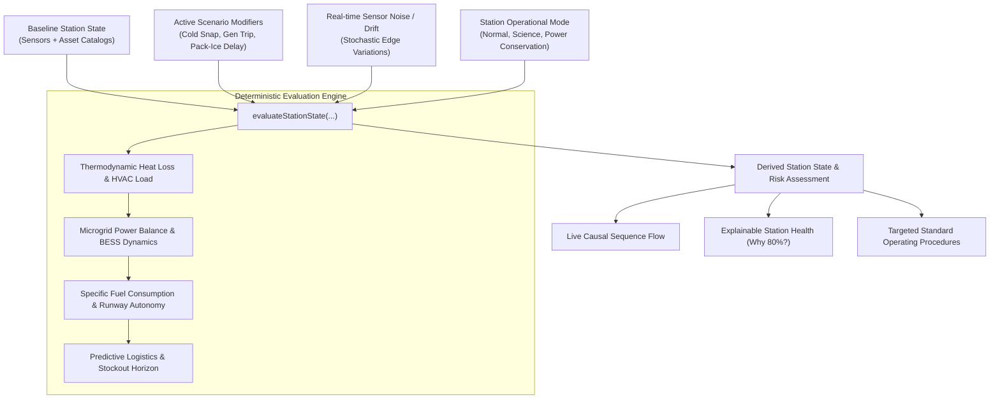

# POLAR COMMAND ❄️
### Antarctic Operational Digital Twin & Mission Control Platform
**Smart India Hackathon Problem Statement — SIH26060**

[](https://sih.gov.in)
[](https://nextjs.org)
[](https://www.typescriptlang.org)
[](https://vitest.dev)
[](https://github.com/Rahulcoder-881/polar-command)

> **POLAR COMMAND** is a deterministic, cross-domain Operational Digital Twin and Mission Control framework engineered for the remote monitoring, predictive decision support, and logistics optimization of India's Antarctic research stations:
> - **Maitri Station** ($70^\circ46'\text{S}, 11^\circ44'\text{E}$ — Schirmacher Oasis, Queen Maud Land)
> - **Bharati Station** ($69^\circ24'\text{S}, 76^\circ11'\text{E}$ — Larsemann Hills, East Antarctica)

---

## 📌 Table of Contents
1. [Operational Challenge & Purpose](#-operational-challenge--purpose)
2. [The 4 Connected SIH26060 Domains](#-the-4-connected-sih26060-domains)
3. [Deterministic State Evaluation Pipeline](#-deterministic-state-evaluation-pipeline)
4. [Command Center V3 Layout & Hierarchy](#-command-center-v3-layout--hierarchy)
5. [Key Functional Subsystems & Features](#-key-functional-subsystems--features)
6. [Interactive Spatial Digital Twin (2D Blueprint)](#-interactive-spatial-digital-twin-2d-blueprint)
7. [What-If Simulator & Recovery Testing](#-what-if-simulator--recovery-testing)
8. [Acceptance Test Matrix (Jury Walkthrough)](#-acceptance-test-matrix-jury-walkthrough)
9. [Edge Offline Resilience & Synchronisation](#-edge-offline-resilience--synchronisation)
10. [Data Provenance & Anti-Hallucination](#-data-provenance--anti-hallucination)
11. [Unit Test Suite (10/10 Vitest)](#-unit-test-suite-1010-vitest)
12. [Technology Stack](#-technology-stack)
13. [Getting Started & Local Setup](#-getting-started--local-setup)
14. [Repository Structure & API Endpoints](#-repository-structure--api-endpoints)

---

## 🏔️ Operational Challenge & Purpose

Operating in Antarctica involves extreme environmental isolation, katabatic gales exceeding $100\text{ km/h}$, temperatures falling below $-40^\circ\text{C}$, and high supply delivery fragility governed by seasonal pack-ice access windows.

Traditional siloed monitoring dashboards fail because a physical event in one domain propagates across other domains:
- An extreme drop in temperature causes a spike in thermal heating demand.
- Increased heating load demands more microgrid power.
- Extra generator load accelerates fuel burn.
- Higher fuel burn contracts fuel runway inside the resupply arrival window.
- What seemed like a weather alert quickly becomes a critical logistics emergency.

**POLAR COMMAND replaces disjointed telemetry with ONE connected operational state engine:**

$$\mathbf{ENVIRONMENT} \longleftrightarrow \mathbf{ENERGY} \longleftrightarrow \mathbf{INFRASTRUCTURE} \longleftrightarrow \mathbf{LOGISTICS}$$

### The Core Operational Workflow
$$\mathbf{OBSERVE} \longrightarrow \mathbf{UNDERSTAND} \longrightarrow \mathbf{PREDICT} \longrightarrow \mathbf{SIMULATE} \longrightarrow \mathbf{ACT}$$

### The Canonical Causal Propagation

```mermaid
flowchart LR
    A["❄️ Extreme Cold (-12°C)"] --> B["🔥 HVAC Thermal Draw (+195 kW)"]
    B --> C["⚡ Microgrid Demand Surges"]
    C --> D["⚙️ Genset Load Rises / Deficit"]
    D --> E["🛢️ Fuel Burn Rate Accelerates"]
    E --> F["📉 Fuel Runway Drops < 14d Safety Buffer"]
    F --> G["🚨 Logistics Risk Escalates to CRITICAL"]
    G --> H["📋 Actionable Operator SOP Triggered"]
```


---

## 🌐 The 4 Connected SIH26060 Domains

| Domain | Key Metrics Monitored | Cross-Domain Coupling Function |
| :--- | :--- | :--- |
| **ENVIRONMENT** | Ambient Temp, Wind Speed, Wind Chill, Blizzard Probability, Solar Radiation, Barometric Trend | Drives building thermal transmission loss: $\Delta T = T_{\text{setpoint}} - T_{\text{ambient}}$ |
| **ENERGY** | Microgrid Generation (Gensets #1 & #2), Electrical Demand, BESS Battery State, CHP Heat Output | Determines net balance: $P_{\text{net}} = P_{\text{generation}} - P_{\text{demand}}$. Triggers BESS discharge on deficit. |
| **INFRASTRUCTURE** | HVAC Loop, RO Desalination, Melt Tank System, Life Support Redundancy, SATCOM Array | Monitors degraded mechanical nodes; provides load shedding targets during power deficit. |
| **LOGISTICS** | Bulk Cryogenic Fuel Farm, Specific Fuel Consumption (SFC), Daily Burn Rate, Resupply ETA | Calculates fuel autonomy: $\text{Runway (Days)} = \frac{\text{Fuel Stock (L)}}{\text{Daily Burn (L/d)}}$. Flags stockout vs vessel arrival. |

---

## ⚙️ Deterministic State Evaluation Pipeline

The entire station state is computed through a single deterministic evaluation pipeline ([`lib/calculations.ts`](file:///d:/SIH%20MVP2/lib/calculations.ts)), ensuring repeatable, non-hallucinatory outcomes:



---

## 🖥️ Command Center V3 Layout & Hierarchy

The interface is engineered to answer an operator's critical questions within **5–10 seconds**:
1. **Which station am I monitoring?** (Maitri vs. Bharati switchable live nodes)
2. **What is its current health?** (Explainable 0–100 index with domain weights & driver attribution)
3. **Is anything wrong?** (Operational status: `NOMINAL`, `WATCH`, `WARNING`, `CRITICAL`)
4. **Why is it happening?** (Physical sensor telemetry root causes)
5. **Which systems are affected?** (Connected topological dependencies)
6. **What will happen next?** ($T+0\text{H}$ to $T+96\text{H}$ predictive horizon)
7. **What should the operator do?** (Actionable Standard Operating Procedures)

```
┌────────────────────────────────────────────────────────────────────────────────────────────────────────┐
│  POLAR COMMAND [SIH26060] | STATIONS: [MAITRI 91%] [BHARATI 80%] | STANCE: [POWER CONSERVATION ▾]     │
├────────────────────────────────────────────────────────────────────────────────────────────────────────┤
│  STATION HEALTH: 80%   │  OPERATIONAL STATUS: ELEVATED RISK  │  NET POWER: -190 kW  │  AUTONOMY:       │
│  Why? Logistics drop   │  0 Critical, 1 Warning              │  DEFICIT (BESS -32kW)│  CONSTRAINED     │
├────────────────────────┴─────────────────────────────────────┴──────────────────────┴──────────────────┤
│                                      ABOVE THE FOLD HERO                                               │
├─────────────────────────────────────────────────────────┬──────────────────────────────────────────────┤
│                     LEFT 65%:                           │                   RIGHT 35%:                 │
│         OPERATIONAL SPATIAL DIGITAL TWIN                │            CROSS-DOMAIN RISK ENGINE          │
│                                                         │                                              │
│   • Generator #1 & #2 (East Power House)                │   • SEVERITY: CRITICAL / WARNING             │
│   • High-Voltage Microgrid Bus Backbone                 │   • EVENT: Incident Headline                 │
│   • BESS Battery Storage Bank (450 kWh)                 │   • WHY: Root Physical Sensor Cause          │
│   • Central HVAC Thermal Loop & Core Habitation         │   • AFFECTED: System Cascade Breadcrumbs     │
│   • Water RO Desalination & Melt Tank System            │   • EXPECTED IMPACT: Real Consequences       │
│   • Cryogenic Bulk Fuel Farm (9,400 L)                  │   • OPERATOR ACTION: Actionable SOP          │
│   • SATCOM Radome Ku/Ka Tracking Array                  │                                              │
│                                                         │   [ EXPLAIN RISK ]      [ SIMULATE IMPACT ]  │
│   [Conduit Highlight: Gen #2 → Grid → BESS → Fuel]      │                                              │
├─────────────────────────────────────────────────────────┴──────────────────────────────────────────────┤
│  LIVE CAUSAL FLOW: Temp (-12°C) → HVAC (195kW) → Demand (451kW) → Fuel Burn (2652L/d) → Risk (CRITICAL)│
├───────────────────────────────────┬────────────────────────────────────┬───────────────────────────────┤
│    NEXT 24 HOURS TIMELINE         │     LOGISTICS INTELLIGENCE         │   MISSION EVENT TIMELINE      │
│    NOW • +6H • +12H • +24H        │     Fuel Runway vs. 14d Safety     │   Observe → Analyze → Act     │
└───────────────────────────────────┴────────────────────────────────────┴───────────────────────────────┘
```

---

## ⚡ Key Functional Subsystems & Features

### 1. Operational Status Consistency
- Never shows *"Nominal Operations Across All Systems"* when unresolved warnings, reduced health, or logistics constraints exist.
- Dynamic domain states:
  - **Energy**: `NOMINAL` / `WARNING` / `CRITICAL`
  - **Water**: `NOMINAL` / `WATCH` / `WARNING`
  - **Life Support**: `NOMINAL` / `WATCH` / `CRITICAL`
  - **Communications**: `NOMINAL` / `WATCH` / `CRITICAL`
  - **Logistics**: `NOMINAL` / `WARNING` / `CRITICAL`

### 2. Cross-Domain Insight (Power vs. Autonomy)
- Prevents operators from misinterpreting short-term telemetry:
  - **Current Power**: `NOMINAL (+69 kW)`
  - **Long-Term Autonomy**: `CONSTRAINED`
  - **Reason**: *Fuel stock ($4.3\text{d}$) is below the mandatory 14-day polar winter safety buffer. A stockout is projected before the resupply vessel's scheduled arrival.*

### 3. Explainable Station Health (`WHY 80%?`)
- Large $48\text{px}$ KPI with explicit multi-domain weightings:
  - **Environment**: 20%
  - **Microgrid Energy**: 30%
  - **Infrastructure**: 25%
  - **Logistics**: 25%
- Dynamic delta and driver attribution:
  - **PRIMARY DRIVER**: *Fuel runway contraction below operational reserve*
  - **SECONDARY DRIVER**: *Pack-ice resupply delay (+12 days)*

### 4. Functional Station Modes (Operational Stances)
Operational modes actively modify physical calculations in real time:
- **`NORMAL`**: Standard polar watchkeeping routine.
- **`SCIENCE OPERATIONS`**: Full scientific experiment array energized ($+20\text{ kW}$).
- **`WEATHER ALERT`**: High-wind stow protocol for satellite dish; outdoor sorties restricted.
- **`POWER CONSERVATION`**: Automatically sheds non-critical load ($-45\text{ kW}$), throttles fuel burn by $16\%$, and protects BESS battery reserves.
- **`EMERGENCY`**: Maximum alert posture; auxiliary cold-reserve gensets prioritized.

---

## 🗺️ Interactive Spatial Digital Twin (2D Blueprint)

The Spatial Twin component ([`components/twin/StationTwin2D.tsx`](file:///d:/SIH%20MVP2/components/twin/StationTwin2D.tsx)) renders an engineering schematic of the station modules:

```
┌────────────────────────────────────────────────────────────────────────────────────────┐
│                        ANTARCTIC STATION 2D SPATIAL BLUEPRINT                          │
│                                                                                        │
│    ┌──────────────┐          ┌───────────────────┐          ┌──────────────┐           │
│    │ GENERATORS   │═════════▶│ HIGH-VOLTAGE GRID │◀═════════│ BESS BATTERY │           │
│    │ Gen #1, #2   │          │ Microgrid Bus     │          │ 450 kWh Bank │           │
│    └──────────────┘          └─────────┬─────────┘          └──────────────┘           │
│           │                            │                                               │
│           ▼                            ▼                                               │
│    ┌──────────────┐          ┌───────────────────┐          ┌──────────────┐           │
│    │ BULK FUEL    │          │ CENTRAL HVAC LOOP │═════════▶│ WATER SYSTEM │           │
│    │ Cryo Tanks   │          │ Habitation Core   │          │ RO Desal     │           │
│    └──────────────┘          └─────────┬─────────┘          └──────────────┘           │
│                                        │                                               │
│                                        ▼                                               │
│                              ┌───────────────────┐                                     │
│                              │ SATCOM RADOME     │                                     │
│                              │ Ku/Ka Band Array  │                                     │
│                              └───────────────────┘                                     │
└────────────────────────────────────────────────────────────────────────────────────────┘
```

- **Interactive Selection**: Clicking any asset opens its engineering telemetry drawer.
- **Animated Cascade Conduit**: The active causal path lights up dynamically across connected conduits (e.g., `Generator 2` $\rightarrow$ `Microgrid` $\rightarrow$ `BESS Battery` $\rightarrow$ `Fuel`).

---

## 🔮 What-If Simulator & Recovery Testing

Located at [`/simulator`](file:///d:/SIH%20MVP2/app/simulator/page.tsx), the multi-horizon timeline simulator allows testing compounded crises across **`T+0H` $\rightarrow$ `T+6H` $\rightarrow$ `T+12H` $\rightarrow$ `T+24H` $\rightarrow$ `T+48H` $\rightarrow$ `T+72H` $\rightarrow$ `T+96H`**.

### Preset Stress Scenarios
1. **Generator #2 Emergency Lockout**: Drops generation by $260\text{ kW}$, triggering immediate microgrid deficit.
2. **Extreme Antarctic Cold Snap**: Drops temperature $-12^\circ\text{C}$, surging HVAC draw to $195\text{ kW}$.
3. **Katabatic Blizzard**: Wind speeds exceed $85\text{ km/h}$, forcing dish stowage and thermal loss.
4. **Pack-Ice Resupply Delay**: Pushes vessel ETA by $+12$ to $+25$ days, testing winter fuel autonomy.
5. **Compounded Crisis**: Activates all 4 stressors simultaneously.

### One-Click Recovery Action
- Operators can click **`[RUN RECOVERY SIMULATION]`** to test restorative actions before execution.
- Clicking **`[EXECUTE RECOVERY ACTION]`** brings cold-standby generation online, balances the microgrid, halts battery drain, and restores station health.

---

## 🧪 Acceptance Test Matrix (Jury Walkthrough)

| Step | User Action | Expected Physical Result | System Response |
| :---: | :--- | :--- | :--- |
| **1** | **Baseline Start** | Bharati starts nominal. Health $93\%$, Net Power $+69\text{ kW}$, 0 critical alerts. | Status: `NOMINAL` |
| **2** | **Trip Generator #2** | Genset #2 switches to `OFFLINE`. Generation drops to $261\text{ kW}$. Net balance drops to **`-190 kW POWER DEFICIT`**. Battery begins discharging. | Status flips to `CRITICAL`. Microgrid cascade highlights. |
| **3** | **Cold Snap** | Ambient temp drops $-12^\circ\text{C}$. HVAC heating draw surges to $195\text{ kW}$. Fuel burn accelerates. Power deficit widens. | Health index drops. Thermal overdrive alert triggers. |
| **4** | **Resupply Delay** | Pack-ice delay (+12d) applied. Resupply ETA shifts to 30 days. Fuel runway ($18.2\text{d}$) contracts inside arrival window. | Logistics status flips to `CRITICAL`. Shortage date calculated. |
| **5** | **Explain Risk** | Operator clicks `[EXPLAIN RISK]`. | Drawer opens showing the 5-step causal sequence with provenance tags. |
| **6** | **Simulate Impact** | Operator clicks `[SIMULATE IMPACT]`. | Simulator projects battery depletion at $T+24\text{H}$ and fuel exhaustion at $T+72\text{H}$. |
| **7** | **Recovery Simulation** | Operator clicks `[EXECUTE RECOVERY ACTION]`. | Generator restored, power reserve positive, battery stabilizes, and risk clears. |
| **8** | **Reset Nominal** | Operator clicks `Reset Baseline`. | Composable scenario events reset cleanly to baseline across all 4 domains. |

---

## 📡 Edge Offline Resilience & Synchronisation

Antarctic stations frequently endure satellite communication blackouts due to solar storms or atmospheric interference. POLAR COMMAND implements a robust **Edge-First Architecture**:

- **Three Connection States**:
  - `CONNECTED`: Real-time bi-directional telemetry streaming with NCPOR headquarters.
  - `INTERMITTENT`: Low-bandwidth sync mode; non-critical telemetry throttled.
  - `DISCONNECTED`: Autonomous edge mode. All operator actions (`ALERT_ACK`, `REQUISITION_CREATE`, `CONFIG_CHANGE`) are written to an in-memory **Edge Queue**.
- **Atomic Queue Flush**:
  - Upon reconnection, the edge queue flushes automatically, executing idempotent state reconciliations with the central NCPOR server.

---

## 🔍 Data Provenance & Anti-Hallucination

Every metric in POLAR COMMAND displays an explicit **Data Provenance Badge**:

| Badge | Provenance Source | Meaning |
| :--- | :--- | :--- |
| `Public Observation` | ECMWF ERA5 & IMD Synoptic Models | Real-world meteorological observations |
| `Synthetic Telemetry` | Station Edge SCADA Instrumentation | Direct physical device telemetry |
| `Derived Calculation` | Thermodynamic & Electrical Equations | Deterministically computed output |
| `Prototype Forecast` | Physical Simulation Engine | Projected multi-horizon trajectory |

---

## 🧪 Unit Test Suite (10/10 Vitest)

Execute the deterministic calculation and state coupling test suite with:

```bash
npm test
```

### Verified Test Cases:
1. `correctly evaluates cold + wind combination with thermodynamic heating surge`
2. `evaluates generator failure + cold leading to microgrid deficit and battery discharge`
3. `evaluates generator failure + resupply delay leading to accelerated fuel burn and logistics gap`
4. `composably handles all four simultaneous events in a single deterministic derived state`
5. `validates edge queue buffering when disconnected`
6. `simulates flush and sync on reconnection`
7. `calculates deterministic fuel runway days with varying load and genset counts`
8. `computes daysRemaining = quantity / dailyConsumption and assigns SAFE/WARNING/PROJECTED SHORTAGE/CRITICAL`
9. `correctly transitions risk from nominal to elevated to critical as thresholds breach`
10. `strictly enforces role permissions at action layer`

---

## 🛠️ Technology Stack

| Layer | Technology |
| :--- | :--- |
| **Framework** | Next.js 14 (App Router, Server Components & Client Hydration) |
| **Language** | TypeScript 5.7 (Strict Type Checking) |
| **Styling** | Vanilla CSS + Tailwind CSS (Antarctic Mission Control Palette) |
| **Typography** | `Inter` / `IBM Plex Sans` (UI) & `IBM Plex Mono` (Telemetry & IDs) |
| **Icons & Graphics** | Lucide React + Vector SVG Spatial Blueprints |
| **Data Visualization** | Recharts (Time-series telemetry & load duration curves) |
| **Testing** | Vitest (Deterministic calculation test suites) |

### Antarctic Color Tokens
- **Polar Navy**: `#08243A` (Base mission control background)
- **Deep Ocean Navy**: `#0C2D48` (Operational surface cards)
- **Ice Cyan**: `#00B8E6` (Key metrics, links & conduits)
- **Glacier Mist**: `#EAF7FC` (High-contrast typography)
- **Operational Green**: `#10B981` (Nominal safe status)
- **Warning Amber**: `#F59E0B` (Advisory threshold breach)
- **Critical Red**: `#E53935` (Active trip or life-support emergency)

---

## 🚀 Getting Started & Local Setup

### Prerequisites
- Node.js 18.x or 20.x
- npm or yarn

### 1. Installation
```bash
# Clone the repository
git clone https://github.com/Rahulcoder-881/polar-command.git
cd polar-command

# Install dependencies
npm install
```

### 2. Development Server
```bash
npm run dev
```
Open [http://localhost:3000](http://localhost:3000). The app automatically redirects to `/dashboard`.

### 3. Running Unit Tests
```bash
npm test
```

### 4. Production Build & Start
```bash
npm run build
npm run start
```

---

## 📁 Repository Structure & API Endpoints

```
polar-command/
├── app/
│   ├── dashboard/          # Primary Command Center V3
│   ├── digital-twin/       # Full 2D Spatial Twin Explorer
│   ├── simulator/          # What-If Timeline-Based Stress Simulator
│   ├── energy/             # Microgrid, Generation & Battery Telemetry
│   ├── environment/        # Weather, Katabatic Wind & Blizzard Risk
│   ├── infrastructure/     # Asset Health, Maintenance & Degraded Nodes
│   ├── logistics/          # Fuel Farm, Inventory Runways & Requisitions
│   ├── alerts/             # Active Threshold Alerts & SOP Remediation
│   ├── reports/            # Operational SITREP & PDF Export
│   └── api/                # Edge Telemetry, State & Simulation Routes
│       ├── stations/       # Station telemetry and live derived state
│       ├── simulation/     # Multi-horizon stress simulation engine
│       ├── logistics/      # Requisitions and inventory ledger
│       └── edge/           # Offline queue synchronization
├── components/
│   ├── layout/             # Low-footprint TopBar & Offline Sync Banner
│   ├── twin/               # StationTwin2D schematic blueprint with connected paths
│   └── common/             # ProvenanceBadge and UI widgets
├── context/
│   └── StationContext.tsx  # Central Digital Twin State Provider & Edge Queue
├── lib/
│   ├── calculations.ts     # Deterministic evaluation pipeline & simulation formulas
│   └── permissions.ts      # Action-layer RBAC enforcement
├── mocks/
│   └── stationData.ts      # Maitri and Bharati baseline data
├── tests/
│   └── calculations.test.ts # Vitest verification test suites
└── types/
    └── index.ts            # Strict TypeScript domain interfaces
```

---

## 📄 License & Attribution
Developed for **Smart India Hackathon (SIH26060)**.  
Reference station data based on public records from the **National Centre for Polar and Ocean Research (NCPOR)**, Ministry of Earth Sciences, Government of India.  
All synthetic telemetry and simulations are strictly tagged with verifiable provenance.
